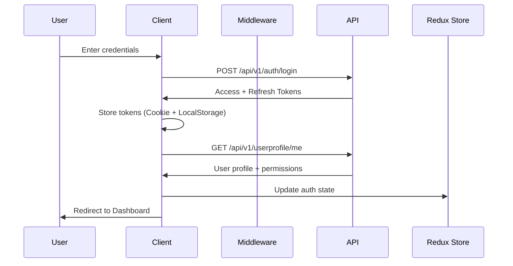

# Architecture Documentation

## Table of Contents
1. [Overview](#overview)
2. [Authentication Flow](#authentication-flow)
3. [Authorization System](#authorization-system)
4. [State Management](#state-management)
5. [API Layer](#api-layer)
6. [Component Architecture](#component-architecture)
7. [Security Considerations](#security-considerations)

## Overview

Volcanion Admin Dashboard is built using modern web technologies with a focus on security, scalability, and maintainability. The application follows a layered architecture pattern with clear separation of concerns.

### Technology Stack

```
┌─────────────────────────────────────────┐
│           Next.js 14 (App Router)       │
├─────────────────────────────────────────┤
│  React 18  │  TypeScript 5  │  MUI v5   │
├─────────────────────────────────────────┤
│   Redux Toolkit   │    RTK Query        │
├─────────────────────────────────────────┤
│      Axios HTTP Client + Interceptors   │
├─────────────────────────────────────────┤
│         Backend API (REST)              │
└─────────────────────────────────────────┘
```

## Authentication Flow

### Login Process



### Token Management

#### Access Token
- **Lifetime**: 15 minutes (configurable)
- **Storage**: Cookie (HTTPOnly) + LocalStorage (fallback)
- **Usage**: Attached to all API requests via Authorization header
- **Refresh**: Auto-refreshed when expired (30s buffer)

#### Refresh Token
- **Lifetime**: 7 days (configurable)
- **Storage**: Cookie (HTTPOnly) + LocalStorage (fallback)
- **Usage**: Only used to obtain new access token
- **Revocation**: Removed on logout

### Auto Token Refresh

```typescript
// API Interceptor (src/lib/api-client.ts)
1. Before Request:
   - Check if access token exists
   - Check if token is expired (with 30s buffer)
   - If expired → Refresh token
   - Attach new token to request

2. On 401 Response:
   - Attempt token refresh
   - Retry original request
   - If refresh fails → Redirect to login
```

## Authorization System

### Multi-Layer Authorization

The system implements three authorization mechanisms:

#### 1. Role-Based Access Control (RBAC)

```
User → Roles → Permissions → Resources

Example:
User "John" → Role "Admin" → Permission "users:create" → Can create users
```

**Implementation:**
```typescript
// Check if user has role
const { hasRole } = usePermission();
if (hasRole('Admin')) { /* ... */ }
```

#### 2. Permission-Based Access Control (PBAC)

```
User → Direct Permissions → Resources

Example:
User "Jane" → Permission "documents:edit" → Can edit documents
```

**Implementation:**
```typescript
// Check if user has permission
const { hasPermission } = usePermission();
if (hasPermission('documents:edit')) { /* ... */ }
```

#### 3. Policy-Based Access Control (Advanced)

```
User → Policies (with conditions) → Resources

Example:
Policy: "OwnerCanEdit"
  Resource: documents
  Action: edit
  Condition: userId === documentOwnerId
```

**Implementation:**
```typescript
// Evaluate policy on backend
POST /api/v1/authorization/evaluate
{
  userId: "user-id",
  resource: "documents",
  action: "edit",
  context: { documentOwnerId: "user-id" }
}
```

### Permission Checking Layers

```
┌──────────────────────────────────────┐
│  1. Route Level (Middleware)         │  ← Blocks unauthorized access
├──────────────────────────────────────┤
│  2. Page Level (AuthGuard)           │  ← Protects entire pages
├──────────────────────────────────────┤
│  3. Component Level (PermissionGuard)│  ← Shows/hides UI elements
├──────────────────────────────────────┤
│  4. API Level (Backend)              │  ← Final authorization check
└──────────────────────────────────────┘
```

## State Management

### Redux Store Structure

```typescript
store
├── auth                 // Authentication state
│   ├── user            // Current user object
│   ├── isAuthenticated // Auth status
│   └── isLoading       // Loading state
│
├── ui                   // UI preferences
│   ├── themeMode       // light | dark
│   ├── sidebarOpen     // Sidebar visibility
│   ├── sidebarCollapsed
│   └── pageTitle       // Current page title
│
└── api (RTK Query)      // API cache & state
    ├── authApi         // Auth endpoints
    ├── userApi         // User profile endpoints
    ├── rolesApi        // Roles CRUD
    ├── permissionsApi  // Permissions CRUD
    ├── policiesApi     // Policies CRUD
    └── authorizationApi // Authorization checks
```

### RTK Query Benefits

- ✅ Automatic caching
- ✅ Automatic re-fetching
- ✅ Optimistic updates
- ✅ Built-in loading/error states
- ✅ Tag-based cache invalidation
- ✅ Polling support
- ✅ TypeScript integration

## API Layer

### Architecture

```
Component
    ↓
RTK Query Hook (useGetRolesQuery)
    ↓
RTK Query API (rolesApi)
    ↓
Base Query (fetchBaseQuery)
    ↓
API Client (Axios)
    ↓
Interceptors (Auth, Error Handling)
    ↓
Backend API
```

### Request Flow

```typescript
// 1. Component makes request
const { data, isLoading } = useGetAllRolesQuery({});

// 2. RTK Query checks cache
// 3. If not cached, makes API call
// 4. API Client intercepts request
// 5. Adds Authorization header
// 6. Sends to backend
// 7. Response intercepted
// 8. Handles errors (401 → refresh token)
// 9. Returns data to component
```

### Error Handling

```typescript
try {
  await createRole(data).unwrap();
} catch (error) {
  // Auto-typed error from RTK Query
  toast.error(error.message);
}
```

## Component Architecture

### Component Hierarchy

```
App (Root)
│
├── Providers (Redux + MUI)
│   │
│   ├── AuthGuard (Route Protection)
│   │   │
│   │   └── DashboardLayout
│   │       ├── Header
│   │       ├── Sidebar
│   │       │   └── PermissionGuard (Menu Items)
│   │       │
│   │       └── Page Content
│   │           └── PermissionGuard (UI Elements)
│   │
│   └── Public Pages (Login/Register)
```

### Reusable Components

#### DataTable
- Server-side pagination
- Sorting
- Filtering
- Custom cell rendering
- Row selection
- Loading states

#### Modal/Drawer
- Backdrop click control
- Keyboard shortcuts (ESC)
- Custom actions
- Responsive sizing

#### Permission Guard
- Hide/show based on permissions
- Fallback component support
- Multiple permission checks (AND/OR)

## Security Considerations

### Frontend Security

#### 1. Token Storage
```typescript
// HTTPOnly cookies (preferred for production)
// Prevents XSS attacks
setCookie(TOKEN_KEY, token, { httpOnly: true });

// LocalStorage (fallback)
// Easier for development
localStorage.setItem(TOKEN_KEY, token);
```

#### 2. XSS Protection
- React auto-escapes content
- No `dangerouslySetInnerHTML` usage
- Sanitize user inputs

#### 3. CSRF Protection
- SameSite cookie policy
- Token-based requests

#### 4. Route Protection
```typescript
// middleware.ts
export function middleware(request: NextRequest) {
  const token = request.cookies.get(ACCESS_TOKEN);
  
  if (isProtectedRoute && !token) {
    return redirect('/login');
  }
}
```

### Backend Security (Recommendations)

1. **Token Security**
   - Short-lived access tokens
   - Refresh token rotation
   - Token revocation list

2. **Password Security**
   - Bcrypt hashing
   - Password strength requirements
   - Rate limiting on login

3. **API Security**
   - Input validation
   - SQL injection prevention
   - Rate limiting
   - CORS configuration

## Data Flow

### Example: Create Role Flow

```
1. User clicks "Create Role" button
   └─> Opens Modal

2. User fills form and submits
   └─> React Hook Form validates
       └─> If valid → Call mutation

3. RTK Query mutation
   └─> createRoleMutation()
       └─> POST /api/v1/authorization/roles

4. API Client interceptor
   └─> Adds Authorization header
       └─> Sends request

5. Backend processes
   └─> Creates role
       └─> Returns response

6. Response interceptor
   └─> Checks for errors
       └─> Returns data

7. RTK Query updates cache
   └─> Invalidates 'Roles' tag
       └─> Auto-refetches role list

8. UI updates
   └─> Close modal
       └─> Show success toast
           └─> Table refreshes with new data
```

## Performance Optimizations

### 1. Code Splitting
```typescript
// Next.js automatically code-splits pages
// Dynamic imports for heavy components
const HeavyComponent = dynamic(() => import('./Heavy'));
```

### 2. Memoization
```typescript
// useMemo for expensive calculations
const filteredData = useMemo(
  () => data.filter(item => item.active),
  [data]
);
```

### 3. RTK Query Caching
```typescript
// Automatic caching with tags
providesTags: ['Roles']
invalidatesTags: ['Roles']
```

### 4. Virtualization
- Large lists use MUI DataGrid with pagination
- Server-side pagination for large datasets

## Testing Strategy

### Recommended Tests

1. **Unit Tests**
   - Utils (formatters, helpers)
   - Permission checking logic
   - Redux slices

2. **Integration Tests**
   - Component + API interaction
   - Form submission flows
   - Permission guards

3. **E2E Tests**
   - Login flow
   - CRUD operations
   - Permission-based UI rendering

## Deployment

### Build Process

```bash
# 1. Install dependencies
npm install

# 2. Type check
npm run type-check

# 3. Lint
npm run lint

# 4. Build
npm run build

# 5. Start production server
npm start
```

### Environment Variables

```env
# Required
NEXT_PUBLIC_API_BASE_URL=https://api.production.com

# Optional
NEXT_PUBLIC_APP_NAME=Admin Dashboard
NEXT_PUBLIC_COOKIE_DOMAIN=.production.com
NEXT_PUBLIC_COOKIE_SECURE=true
```

## Scalability

### Future Enhancements

1. **ABAC (Attribute-Based Access Control)**
   - User attributes (department, location)
   - Resource attributes (sensitivity, classification)
   - Environmental attributes (time, IP address)

2. **Multi-tenancy**
   - Tenant isolation
   - Tenant-specific permissions
   - Cross-tenant data access

3. **Audit Logging**
   - Track all permission checks
   - Log user actions
   - Compliance reporting

4. **Real-time Updates**
   - WebSocket integration
   - Live permission updates
   - Collaborative features

---

**Last Updated**: December 2025
